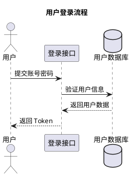
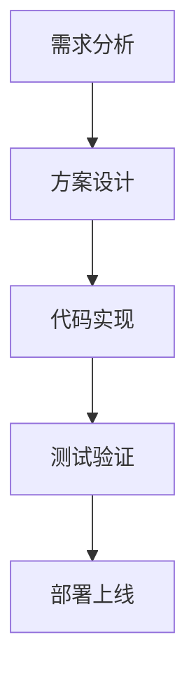

# Java 后端开发自动化技术方案工具指南

> 帮助工程师自动化输出技术方案，减少人工设计成本

**更新时间:** 2026-03-19  
**适用场景:** 日常需求对接、技术方案设计、代码生成

---

## 🎯 核心目标

| 目标 | 说明 |
|------|------|
| 减少人工设计 | 用工具自动生成方案初稿 |
| 提高效率 | 标准化流程，减少重复劳动 |
| 保证质量 | 自动化验证方案可行性 |
| 知识沉淀 | 方案即文档，便于复用 |

---

## 🛠️ 自动化技术方案生成工具

### 1️⃣ AI 辅助设计工具

| 工具 | 功能 | 适用场景 | 价格 |
|------|------|---------|------|
| **GitHub Copilot** | 代码补全、方案建议 | 日常编码、架构设计 | $10/月 |
| **Cursor** | AI 驱动的代码编辑器 | 需求分析→代码生成 | 免费/$20/月 |
| **通义灵码** | 阿里出品，中文支持好 | 国内团队、Java 生态 | 免费 |
| **Codeium** | 免费 AI 编程助手 | 预算有限团队 | 免费 |
| **Tabnine** | 智能代码补全 | 企业私有化部署 | 免费/$12/月 |

**推荐使用方式:**
```markdown
1. 需求描述输入 AI → 获取功能清单
2. 让 AI 生成技术方案初稿
3. 人工评审 + 调整
4. 输出最终方案文档
```

---

### 2️⃣ 架构设计自动化工具

| 工具 | 功能 | 学习成本 |
|------|------|---------|
| **PlantUML + AI** | 从需求描述生成 UML 图 | 低 |
| **Mermaid Live** | 文本生成架构图、流程图 | 低 |
| **Structurizr** | 代码即架构文档 (C4 模型) | 中 |
| **ArchUnit** | 架构规则自动化验证 | 中 |

**PlantUML 示例:**


**Mermaid 示例:**


---

### 3️⃣ API 设计自动化

**推荐工具链:**
```
OpenAPI 规范 → openapi-generator → Spring Boot 代码
                      ↓
              Apifox/Postman (测试)
                      ↓
            springdoc-openapi (文档)
```

**命令行示例:**
```bash
# 从 OpenAPI 规范生成代码
openapi-generator generate \
  -i api-spec.yaml \
  -g spring \
  -o ./src \
  --additional-properties=interfaceOnly=true

# 从代码生成 API 文档
mvn springdoc-openapi-maven-plugin:generate
```

**工具对比:**

| 工具 | 功能 | 特点 |
|------|------|------|
| **Swagger/OpenAPI** | API 规范先行 | 行业标准 |
| **Apifox** | API 设计 + 测试一体化 | 国产、中文友好 |
| **Postman** | API 测试 + 文档 | 生态丰富 |
| **springdoc-openapi** | Spring Boot 自动生成交互式文档 | 零配置 |

---

### 4️⃣ 数据库设计自动化

| 工具 | 功能 | 适用场景 |
|------|------|---------|
| **PDManer** | 国产数据库建模，支持逆向工程 | 中小团队 |
| **PowerDesigner** | 企业级数据建模 | 大型企业 |
| **SchemaSpy** | 从数据库生成文档 | 文档自动化 |
| **Flyway/Liquibase** | 数据库版本管理 + 文档 | CI/CD 集成 |

**PDManer 工作流:**
```
数据库表设计 → 导出 SQL → 版本管理
      ↓
  生成 ER 图
      ↓
  生成数据字典
```

---

### 5️⃣ 需求→方案自动化工具链

```
┌─────────────┐
│  需求文档   │
│ (Markdown)  │
└──────┬──────┘
       ↓
┌─────────────┐
│  AI 分析    │ → 功能清单 + 技术方案初稿
│ (Copilot)   │
└──────┬──────┘
       ↓
┌─────────────┐
│  架构设计   │ → PlantUML/Mermaid 架构图
│ (PlantUML)  │
└──────┬──────┘
       ↓
┌─────────────┐
│  API 设计   │ → OpenAPI 规范 + Apifox
│ (OpenAPI)   │
└──────┬──────┘
       ↓
┌─────────────┐
│ 数据库设计  │ → PDManer/PowerDesigner
│ (PDManer)   │
└──────┬──────┘
       ↓
┌─────────────┐
│  代码生成   │ → JHipster/EasyCode
│ (JHipster)  │
└──────┬──────┘
       ↓
┌─────────────┐
│  测试生成   │ → auto-tester 生成测试用例
│(auto-tester)│
└──────┬──────┘
       ↓
┌─────────────┐
│  文档生成   │ → Swagger + ArchDoc
│ (ArchDoc)   │
└─────────────┘
```

---

### 6️⃣ 低代码/代码生成平台

| 平台 | 特点 | 适用场景 |
|------|------|---------|
| **JHipster** | Spring Boot + Angular/React 全栈生成 | 新项目快速启动 |
| **JeecgBoot** | 国产低代码平台，支持代码生成 | 企业后台系统 |
| **RuoYi** | 若依框架，快速生成 CRUD | 管理后台 |
| **EasyCode** | IDEA 插件，数据库表→代码一键生成 | 日常 CRUD 开发 |

**EasyCode 使用示例:**
```
1. 安装 EasyCode IDEA 插件
2. 连接数据库
3. 选择数据表 → 右键 Generate Code
4. 选择模板 (Controller/Service/Mapper/Entity)
5. 一键生成完整 CRUD 代码
```

---

### 7️⃣ 文档自动化

**Maven 配置示例:**
```xml
<plugin>
    <groupId>org.asciidoctor</groupId>
    <artifactId>asciidoctor-maven-plugin</artifactId>
    <version>2.2.1</version>
    <configuration>
        <sourceDirectory>src/docs/asciidoc</sourceDirectory>
        <outputDirectory>target/docs</outputDirectory>
        <backend>html</backend>
    </configuration>
    <executions>
        <execution>
            <id>generate-docs</id>
            <phase>prepare-package</phase>
            <goals>
                <goal>process-asciidoc</goal>
            </goals>
        </execution>
    </executions>
</plugin>
```

**推荐工具:**

| 工具 | 功能 | 特点 |
|------|------|------|
| **ArchDoc** | 架构文档自动生成 | 代码即文档 |
| **DocFX** | 微软出品，支持多语言 | 企业级 |
| **MkDocs** | Markdown 生成静态文档站 | 轻量简单 |
| **VuePress** | Vue 驱动的文档站 | 前端友好 |

---

## 💡 推荐的技术方案自动化流程

### 标准工作流

```markdown
## 新需求开发流程

### 1. 📋 需求录入
- 使用标准化模板 (Markdown/飞书文档)
- 包含：业务背景、功能清单、验收标准

### 2. 🤖 AI 分析
- 用 AI 工具生成功能清单
- 输出技术方案初稿
- 识别技术风险点

### 3. 🏗️ 架构设计
- PlantUML/Mermaid 生成架构图
- 定义模块边界和接口
- 评审架构合理性

### 4. 🔌 API 设计
- OpenAPI 规范定义接口
- Apifox 管理 API 文档
- 前后端确认接口契约

### 5. 💾 数据库设计
- PDManer 设计数据模型
- 生成 ER 图和数据字典
- Flyway 管理版本迁移

### 6. 🏭 代码生成
- JHipster/EasyCode 生成项目骨架
- openapi-generator 生成 API 代码
- 填充业务逻辑

### 7. 🧪 测试生成
- auto-tester 生成测试用例
- 覆盖正常/边界/异常场景
- CI/CD 自动执行

### 8. 📊 文档生成
- Swagger 生成 API 文档
- ArchDoc 生成架构文档
- 自动发布到文档站
```

---

## 🎯 具体工具组合推荐

### 小型团队 (3-10 人)

```
┌─────────────────────────────────────────┐
│  通义灵码 + EasyCode + Apifox + auto-tester  │
└─────────────────────────────────────────┘
```

| 工具 | 用途 | 成本 |
|------|------|------|
| 通义灵码 | AI 代码助手 | 免费 |
| EasyCode | 代码生成 | 免费 |
| Apifox | API 设计测试 | 免费/￥99/月 |
| auto-tester | 自动化测试 | 免费 |

**预计效率提升:** 40-60%

---

### 中型团队 (10-50 人)

```
┌─────────────────────────────────────────────────────┐
│  GitHub Copilot + JHipster + Swagger + PDManer + ArchUnit  │
└─────────────────────────────────────────────────────┘
```

| 工具 | 用途 | 成本 |
|------|------|------|
| GitHub Copilot | AI 编程助手 | $10/人/月 |
| JHipster | 全栈代码生成 | 免费 |
| Swagger | API 文档 | 免费 |
| PDManer | 数据库建模 | 免费 |
| ArchUnit | 架构验证 | 免费 |

**预计效率提升:** 50-70%

---

### 大型企业 (50+ 人)

```
┌───────────────────────────────────────────────────────────┐
│  Cursor + Structurizr + PowerDesigner + Flyway + DocFX + CI/CD  │
└───────────────────────────────────────────────────────────┘
```

| 工具 | 用途 | 成本 |
|------|------|------|
| Cursor | AI 代码编辑器 | $20/人/月 |
| Structurizr | 架构即代码 | $29/月 |
| PowerDesigner | 企业数据建模 | 企业授权 |
| Flyway | 数据库版本管理 | 免费/企业版 |
| DocFX | 文档自动化 | 免费 |
| CI/CD | 自动化流水线 | 自建/云服务商 |

**预计效率提升:** 60-80%

---

## 📌 关键建议

### 1. 需求标准化

```markdown
# 需求模板

## 业务背景
[描述业务场景和痛点]

## 功能清单
- [ ] 功能点 1
- [ ] 功能点 2
- [ ] 功能点 3

## 技术方案
### 架构设计
[架构图/模块划分]

### API 设计
[接口定义]

### 数据库设计
[数据模型]

## 验收标准
- [ ] 标准 1
- [ ] 标准 2
```

### 2. API First

```
先定义 API 规范 → 再生成代码 → 最后实现逻辑

好处:
✅ 前后端并行开发
✅ 接口变更可追溯
✅ 自动生成文档和测试
```

### 3. 代码即文档

```java
// 使用 ArchUnit 验证架构规则
@AnalyzeClasses(packages = "com.example")
class ArchitectureTest {
    
    @ArchTest
    static final ArchRule controllers_should_not_access_repositories =
        classes().that().resideInAPackage("..controller..")
            .should().onlyAccessClassesThat().resideInAPackage("..service..");
}
```

### 4. 自动化测试

```bash
# 使用 auto-tester 生成测试
python scripts/auto-tester.py /path/to/project \
  --generate \
  --old-features "用户登录，订单创建" \
  --new-features "优惠券系统，积分奖励"

# 执行回归测试
python scripts/auto-tester.py /path/to/project \
  --execute \
  --type regression \
  --coverage
```

### 5. 持续集成

```yaml
# GitHub Actions 示例
name: Tech Scheme Validation

on:
  push:
    branches: [ main, develop ]

jobs:
  validate:
    runs-on: ubuntu-latest
    steps:
      - uses: actions/checkout@v3
      
      - name: Generate API Docs
        run: mvn springdoc-openapi:generate
      
      - name: Run Architecture Tests
        run: mvn test -Dtest=ArchitectureTest
      
      - name: Generate Test Coverage
        run: mvn jacoco:report
      
      - name: Deploy Docs
        run: |
          mkdocs build
          mkdocs gh-deploy
```

---

## 📊 效率对比

| 环节 | 传统方式 | 自动化方式 | 提升 |
|------|---------|-----------|------|
| 需求分析 | 2-4 小时 | 30 分钟 (AI 辅助) | 75% |
| 架构设计 | 4-8 小时 | 1-2 小时 (模板 + 工具) | 75% |
| API 设计 | 2-4 小时 | 30 分钟 (OpenAPI) | 85% |
| 代码生成 | 1-2 天 | 2-4 小时 (代码生成器) | 75% |
| 测试编写 | 1-2 天 | 2-4 小时 (auto-tester) | 75% |
| 文档编写 | 4-8 小时 | 30 分钟 (自动生成) | 85% |

**整体效率提升:** 60-80%

---

## ⚠️ 注意事项

1. **不要过度依赖工具** - 工具是辅助，核心设计仍需人工评审
2. **保持方案可维护性** - 自动生成的代码也要符合规范
3. **定期更新模板** - 随着技术发展更新工具链
4. **团队培训** - 确保团队成员熟练使用工具
5. **渐进式引入** - 从一个小项目开始，逐步推广

---

## 📖 参考资源

| 资源 | 链接 |
|------|------|
| PlantUML 官方文档 | https://plantuml.com/ |
| OpenAPI 规范 | https://swagger.io/specification/ |
| JHipster | https://www.jhipster.tech/ |
| ArchUnit | https://www.archunit.org/ |
| auto-tester |  workspace/skills/auto-tester/ |

---

*文档生成时间: 2026-03-19*  
*适用于 Java 后端开发团队*
